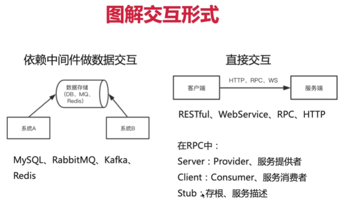
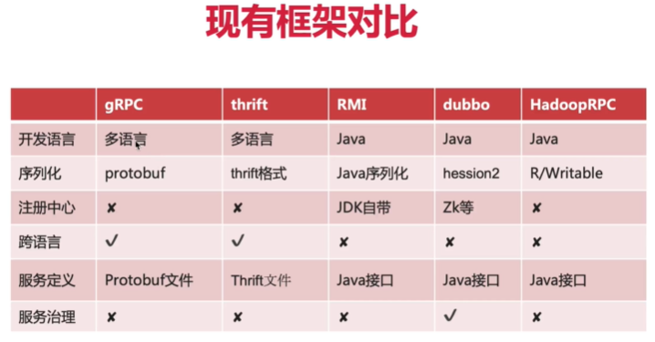
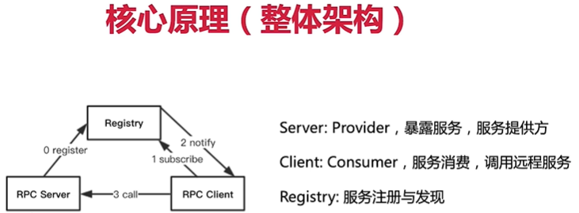
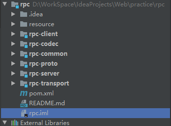

# rpc
Init project

## 说明

[参考链接](https://www.imooc.com/video/20219)

[GitHub代码链接](https://github.com/wangcj2020/rpc)

*`RPC(Remote Procedure Call):远程过程调用，分布式系统常见的一种通信方式---->跨进程或跨物理机`*

>*交互形式：*
>
>
>
>*现有框架对比：*‘
>
>
>
>*核心原理：*
>
>
>

### 3.1实现

#### 3.1.1 类图

>

#### 3.1.2 创建工程

>*工程结构*
>
>
>
>>`pom.xml`添加依赖
>>
>>```xml
>><properties>
>>        <common-version>2.5</common-version>
>>        <jetty-version>9.4.6.v20170531</jetty-version>
>>        <json-version>1.2.36</json-version>
>>
>>        <junit-version>4.12</junit-version>
>>        <lombok-version>1.16.18</lombok-version>
>>        <slf4j-version>1.7.25</slf4j-version>
>>        <logback-version>1.2.3</logback-version>
>>
>>        <compiler-version>3.2</compiler-version>
>>        <jdk-version>1.8</jdk-version>
>>    </properties>
>>
>>    <dependencyManagement>
>>        <!-- 子模块可能用到的依赖 -->
>>        <dependencies>
>>            <dependency>
>>                <groupId>commons-io</groupId>
>>                <artifactId>commons-io</artifactId>
>>                <version>${common-version}</version>
>>            </dependency>
>>
>>            <!-- Servlet容器Jetty -->
>>            <dependency>
>>                <groupId>org.eclipse.jetty</groupId>
>>                <artifactId>jetty-servlet</artifactId>
>>                <version>${jetty-version}</version>
>>            </dependency>
>>
>>            <!-- 序列化 -->
>>            <dependency>
>>                <groupId>com.alibaba</groupId>
>>                <artifactId>fastjson</artifactId>
>>                <version>${json-version}</version>
>>            </dependency>
>>        </dependencies>
>>    </dependencyManagement>
>>
>>    <dependencies>
>>        <!-- 公共依赖 -->
>>        <dependency>
>>            <groupId>junit</groupId>
>>            <artifactId>junit</artifactId>
>>            <version>${junit-version}</version>
>>            <scope>test</scope>
>>        </dependency>
>>
>>        <dependency>
>>            <groupId>org.projectlombok</groupId>
>>            <artifactId>lombok</artifactId>
>>            <version>${lombok-version}</version>
>>        </dependency>
>>
>>        <!-- 日志 -->
>>        <dependency>
>>            <groupId>org.slf4j</groupId>
>>            <artifactId>slf4j-api</artifactId>
>>            <version>${slf4j-version}</version>
>>        </dependency>
>>        <dependency>
>>            <groupId>ch.qos.logback</groupId>
>>            <artifactId>logback-classic</artifactId>
>>            <version>${logback-version}</version>
>>        </dependency>
>>    </dependencies>
>>
>>    <!-- 编译配置 -->
>>    <build>
>>        <plugins>
>>            <plugin>
>>                <groupId>org.apache.maven.plugins</groupId>
>>                <artifactId>maven-compiler-plugin</artifactId>
>>                <version>${compiler-version}</version>
>>                <configuration>
>>                    <source>${jdk-version}</source>
>>                    <target>${jdk-version}</target>
>>                </configuration>
>>            </plugin>
>>        </plugins>
>>    </build>
>>```

#### 3.1.3 工具类组件`rpc-common`

>该组件提供一些自定义工具类，例如反射工具类`ReflectionUtils`，该类提供以下三个方法：
>
>```java
>/**
>     * 根据类对象创建对象
>     * @param clazz 要创建对象的类对象
>     * @param <T> 要创建对象的类型
>     * @return 创建好的对象
>     */
>    public static <T> T newInstance(Class<T> clazz) {
>        try {
>            return clazz.newInstance();
>        } catch (Exception e) {
>            throw new IllegalStateException(e);
>        }
>    }
>
>    /**
>     * 根据类对象获取该类中的public方法(不包含父类)
>     * @param clazz 类对象
>     * @return 指定类所有public方法
>     */
>    public static Method[] getAllPublicMethods(Class clazz){
>        Method[] declaredMethods = clazz.getDeclaredMethods();
>        List<Method> methods = new ArrayList<>();
>
>        for (Method method:declaredMethods) {
>            if(Modifier.isPublic(method.getModifiers())){
>                methods.add(method);
>            }
>        }
>
>        return methods.toArray(new Method[0]);
>    }
>
>    /**
>     * 调用某对象的方法
>     * @param obj 要调用方法的对象
>     * @param method 该对象要调用的方法
>     * @param args 参数
>     * @return 方法返回值
>     */
>    public static Object invoke(Object obj,Method method,Object... args){
>        try {
>            return method.invoke(obj,args);
>        } catch (Exception e) {
>            throw new IllegalStateException(e);
>        }
>    }
>```

#### 3.1.4 序列化模块`rpc-codec`

>该组件提供了编码和解码的接口`Encoder`、`Decoder`，以及一组基于`fastjson`的`Json`编码和解码类
>
>`JsonDecoder`
>
>```java
>public class JsonDecoder implements Decoder{
>
>    @Override
>    public <T> T decode(byte[] bytes, Class<T> clazz) {
>        return JSON.parseObject(bytes,clazz);
>    }
>}
>```
>
>`JsonEncoder`
>
>```java
>public class JsonEncoder implements Encoder {
>    @Override
>    public byte[] encode(Object obj) {
>        return JSON.toJSONBytes(obj);
>    }
>}
>```

#### 3.1.5 协议组件`rpc-proto`

>该组件定义了`Peer、Request、Response、ServiceDescriptor`，分别表示
>
>1. 网络传输中的一个端点：包含端点网络地址`host`及端口号`port`
>2. 一个RPC请求：包含要调用的服务的信息`service`及需要传入的参数`parameters`	
>3. 一个RPC响应：包含响应码`code`、响应信息`message`及响应数据`data`
>4. 记录所有的远程服务信息：包含服务所属类名`clazz`、服务对应的方法名`method`、返回值类型`returnType`及参数类型`parameterTypes`

#### 3.1.6 网络通信组件`rpc-transport`

>该组件定义了客户端与服务器通信的规则`TransportClient`、`TransportServer`以及请求处理接口`RequestHandler`，这些规则和接口都可由使用该框架的人根据实际情况进行实现。
>
>*客户端*：
>
>1. 建立连接
>2. 向服务器端发送请求并等待响应
>3. 关闭连接
>
>*服务器端*：
>
>1. 监听端口
>2. 接受请求并进行处理
>3. 结束监听
>
>该组件提供了一组基于Http的客户端及服务器类`HttpTransportClient`、`HttpTransportServer`，其中服务器采用`jetty`Web容器实现

#### 3.1.7 服务器组件`rpc-server`

>该组件中定义了一下内容：
>
>1. `ServiceInstance`：代表服务端上的一个具体的服务，包含提供该服务的对象以及对应的方法
>
>2. `ServiceInvoker`：服务执行类
>
>3. `ServiceManager`：服务管理类，记录服务器端可以提供的所有服务和服务信息
>
>4. `RpcServerConfig`：Rpc服务端配置类，在其中指定默认网络模块`HttpTransportServer`，序列化模块`JsonEncoder`，反序列化模块`JsonDecoder`，以及要监听的端口`port`
>
>	>```java
>	>/**
>	> * Server 配置
>	> */
>	>@Data
>	>public class RpcServerConfig {
>	>    // 指定网络模块
>	>    private Class<? extends TransportServer> transportClass = HttpTransportServer.class;
>	>    // 指定序列化模块
>	>    private Class<? extends Encoder> encoderClass = JsonEncoder.class;
>	>    private Class<? extends Decoder> decoderClass = JsonDecoder.class;
>	>    // 指定默认端口
>	>    private int port = 3000;
>	>}
>	>```
>
>5. `RpcServer`：代表一个服务器，包含配置对象`config`，网络传输对象`net`，序列化与反序列化对象`encoder,decoder`，服务管理对象`serviceManager`，服务调用对象`serviceInvoker`以及请求处理接口`RequestHandler`的一个具体实现

#### 3.1.8 客户端组件`rpc-client`

>该组件中定义了一下内容：
>
>1. `TransportSelector`：服务端连接选择器，即选择连接哪一个服务端，并提供了一种选择方法`RandomTransportSelector`，即随机选择，在该客户端所有已建立的连接中随机选择一个
>
>2. `RemoteInvoker`：远程调用类，实现客户端远程调用已连接服务器端提供的服务
>
>3. `RpcClientConfig`：Rpc客户端配置类，在其中指定默认网络模块`HttpTransportClient`，序列化模块`JsonEncoder`，反序列化模块`JsonDecoder`，客户端选择器`RandomTransportSelector`，连接数目`connectCount=1`以及可连接的服务端点信息`servers=Arrays.asList(new Peer("127.0.0.1",3000));`
>
>	>```java
>	>/**
>	> * Client 配置
>	> */
>	>@Data
>	>public class RpcClientConfig {
>	>    // 指定网络模块
>	>    private Class<? extends TransportClient> transportClass = HttpTransportClient.class;
>	>    // 指定序列化模块
>	>    private Class<? extends Encoder> encoderClass = JsonEncoder.class;
>	>    private Class<? extends Decoder> decoderClass = JsonDecoder.class;
>	>    // client选择
>	>    private Class<? extends TransportSelector> selectorClass = RandomTransportSelector.class;
>	>    private int connectCount = 1;
>	>    private List<Peer> servers = Arrays.asList(new Peer("127.0.0.1",3000));
>	>}
>	>```
>
>4. `RpcClient`：代表一个客户端，包含配置对象`config`，序列化与反序列化对象`encoder,decoder`，服务端连接选择器对象`selector`，以及远程服务的动态代理对象

### 3.2 使用

#### 例程组件`rpc-example`

>1. `CalculateService`：远程服务接口，并提供了该接口的具体实现`CalculateServiceImpl`
>
>2. `Server`：服务器，根据默认Rpc服务器配置内容创建一个服务器对象，完成服务注册后启动服务器
>
>	>```java
>	>/**
>	> * 服务器
>	> */
>	>public class Server {
>	>    public static void main(String[] args) {
>	>        InetAddress addr = null;
>	>        try {
>	>            addr = InetAddress.getLocalHost();
>	>        } catch (UnknownHostException e) {
>	>            e.printStackTrace();
>	>        }
>	>        assert addr != null;
>	>        String ip=addr.getHostAddress().toString(); //获取本机ip：192.168.142.1
>	>        // 使用默认配置创建服务端对象
>	>        RpcServer server = new RpcServer(new RpcServerConfig());
>	>        // 注册服务
>	>        server.register(CalculateService.class,new CalculateServiceImpl());
>	>        // 启动服务端
>	>        server.start();
>	>    }
>	>}
>	>```
>
>3. `Client`：客户端，根据默认Rpc客户端配置内容创建一个客户端对象，获取远程服务代理后调用并显示调用结果
>
>	>```java
>	>/**
>	> * 客户端
>	> */
>	>public class Client {
>	>    public static void main(String[] args) {
>	>        // 使用默认配置创建客户端对象
>	>        RpcClient client = new RpcClient(new RpcClientConfig());
>	>        // 获取远程代理对象
>	>        CalculateService service = client.getProxy(CalculateService.class);
>	>        // 调用服务
>	>        int add = service.add(3, 2);
>	>        int minus = service.minus(3, 1);
>	>        int mul = service.mul(3, 4);
>	>
>	>        // 显示结果
>	>        System.out.println("add=" + add);
>	>        System.out.println("minus=" + minus);
>	>        System.out.println("mul=" + mul);
>	>    }
>	>}
>	>```

